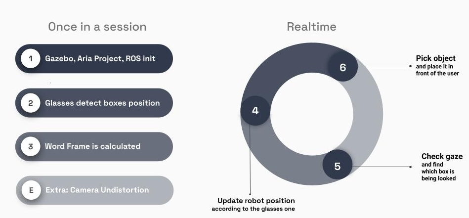
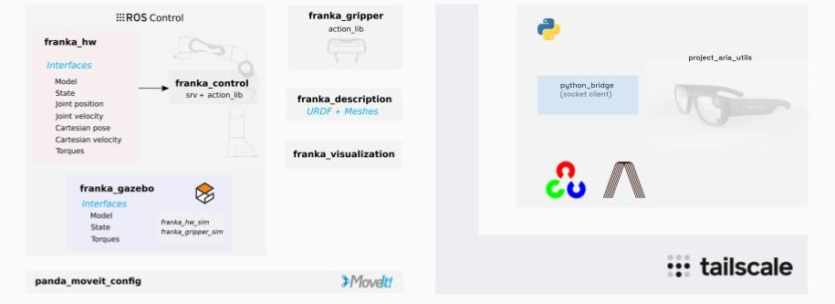

# Gaze-powered CoBot 🤖

Done as the final project of Smart Robotics Course, this repository contains the scripts and the files needed to launch the simulator of the collaborative robot ([Franka Emika Panda](https://frankaemika.github.io/docs/franka_ros.html)) and control it using a real-life [Project Aria device](https://facebookresearch.github.io/projectaria_tools/docs/intro). 

|**Authors 👥**| @jacksalici, @cosimop2000|
|-|-|

|[**Link to the presentation 📺↗️**](slides/GazeBasedCobot.pdf)|
|-|

#### Video Demo

## Objectives 🚀

- **Seamless Human-Robot Interaction 🤖**  
Facilitate user interaction by placing objects near the user wearing smart glasses.

- **Automate Pick & Place Operations 🏗️**  
Use motion planning for precise robotic movement to pick up objects from locations detected using markers.

- **Real-Time Position Communication 📻**  
Accurately communicate the position of boxes relative to the collaborative robot.

- **No need for robot vision 👓**  
Ensure real-time world position estimation using Aruco Marker and smart glasses.

## Application lifecycle ♻️

## Software Architecture 🍱

For installing the MoveIt and ROS / Gazebo part, please refer to the respective tutorial. Then, use the provided `ros_package` in this repo to launch the entire stack.